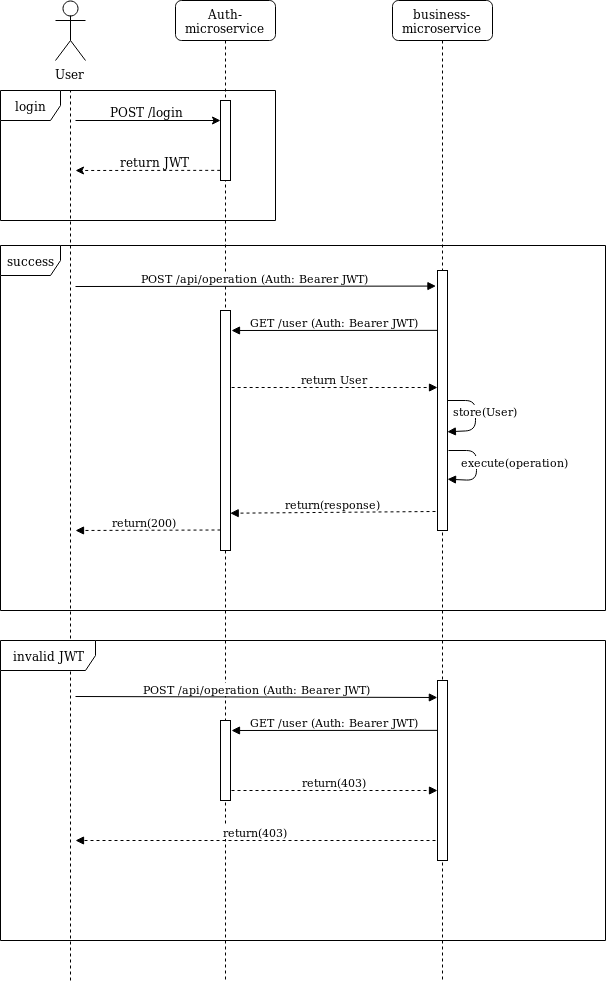

# Django Authentication Service

## Idea behind it

The goal is to have a microservice that handles authentication and user management based on django. Users will authenticate against this service and will retrieve a JWT token with its information. This token will be used on subsequent requests against other microservices, and when the request is received, a communication via REST between the remote service and the authentication microservice will happen in order to verify that the user exists. If the user exists his/her information will be retrieved and stored in the local django database of the remote service.

## Sequence diagram

The next sequence diagram explains the process on how to authenticate and use the bearer token on microservices. The JWT verification is executed via REST but can be extended to use other protocols such as gRPC.


A JWT is self signed and it can contain user information within is body. This is configurable using the django-jwt project and it is up to the developer to see which information to send. By personal experienc, the JWT should contain the least amount of user data and the rest will be retrieved when doing the JWT verification.

## Tech stack

* Pipenv for dependency and environment management
* Django
* Django rest framework
* Django JWT
* Docker
* Graphene

## What to do

Just clone this project or fork it out then start using it. The user model currently have the next information:

```json
{
    "first_name": "str",
    "last_name": "str",
    "email": "str",
    "phone_number": "str",
}
```

As we see the email works as a username and the django user manager was extended in order to support this change.

## How to run

There are 2 easy ways to launch this project:

### Docker

* Install docker
* run `$ docker build -t authentication .` to build the docker image.
* execute `$ docker run -p 8000:8000 authentication` to execute the service.
* access the swagger specification by calling `localhost:8000/api/schema`

### Local development

* Make sure you have python 3.7 installed, if you are on ubuntu is enough with `$ sudo apt install python3.7`
* Install pipenv easily by doing `$ python3.7 -m pip install --user pipenv`
* On the project folder run `$ pipenv install`
* Activate the environment by running `$ pipenv shell`
* Apply migrations by calling `$ pipenv run python manage.py migrate`
* Create a user using django manage.py command `$ pipenv run python manage.py createsuperuser` and follow the assistant.
* Run the server by executing `$ pipenv run python manage.py runserver`
* Access `localhost:8000/api/schema`
* Log-in by doing `POST localhost:8000/auth/login` and retrieve the JWT token:
```json
{
    "email": "string",
    "password": "string"
}
```

## How to extend

You can easily modify the model by just going to the `auth.models.User` class and add new fields using the django ORM specification. This project will work along with https://github.com/Tibiritabara/django-auth-connector
